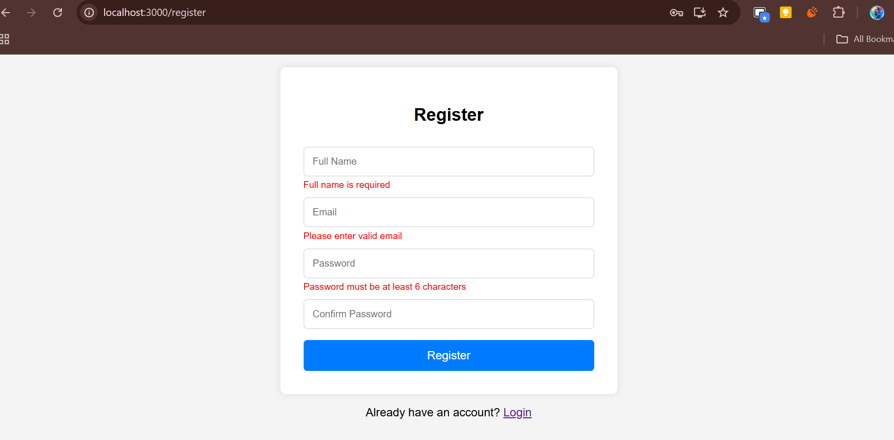
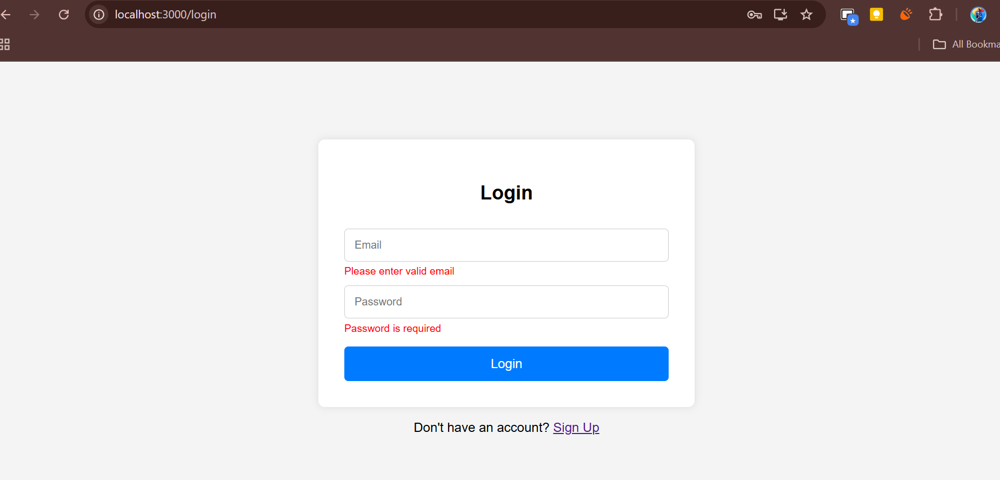
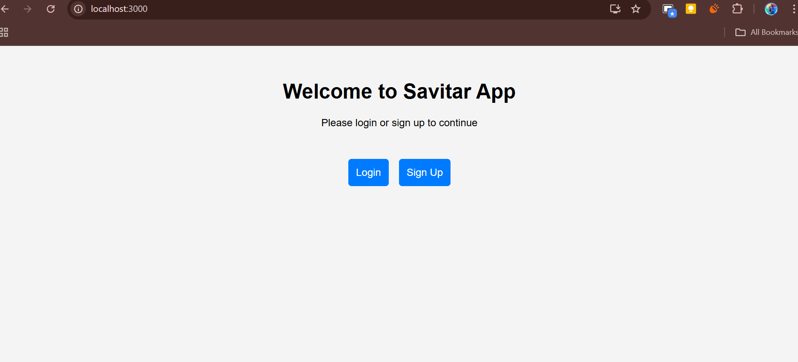

# Savitar App - Login & Registration Forms

This is a responsive authentication UI built using **React + TypeScript**. It includes a **Home page**, **Login form**, and **Sign Up (Register) form** with complete **client-side validation**.

## Preview

## Features

- Built with **React + TypeScript**
- Client-side **form validation**
- Navigation using **React Router**
- **Responsive** design for mobile, tablet, and desktop
- Form validations on **blur** and **submit**
- Clean UI with custom styling (no frameworks used)

---

## Pages Included

| Page       | Path         | Description                          |
|------------|--------------|--------------------------------------|
| Home       | `/`          | Landing page with links to login/register |
| Register   | `/register`  | User sign-up form                    |
| Login      | `/login`     | User login form                      |

---

## Form Validations Implemented

### Register Form
| Field            | Validation Rules                                        |
|------------------|----------------------------------------------------------|
| **Full Name**    | Required                                                 |
| **Email**        | Required, valid email format using RegEx                |
| **Password**     | Required, at least **6 characters**                     |
| **Confirm Pass** | Required, must **match** password                       |

- Validation triggers on `onBlur` and `onSubmit`

### Login Form
| Field         | Validation Rules                    |
|---------------|--------------------------------------|
| **Email**     | Required, valid email format         |
| **Password**  | Required                             |

- Validation triggers on `onBlur` and `onSubmit`

---

## Setup Instructions

### 1. Clone the repository
git clone https://github.com/yourusername/savitar-auth.git

### 2. Install dependency 
npm install

### 3. Install dependency 
npm run dev
